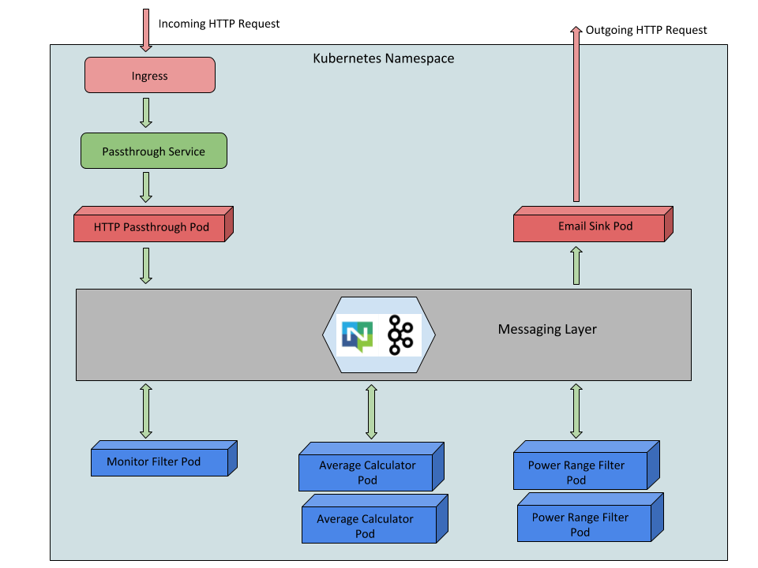

Siddhi is a cloud native Streaming and Complex Event Processing engine that understands Streaming SQL queries in order to capture events from diverse data sources, process them, detect complex conditions, and publish output to various endpoints in real time. 

Siddhi operator allows you to run Siddhi stream processing logic directly on a Kubernetes cluster.

Siddhi uses various types of sources to receive events like HTTP, Kafka, NATS, and Prometheus etc. Siddhi operator by default use NGINX ingress controller to receive HTTP/HTTPS requests. Therefore first you have to [enable ingress](https://kubernetes.github.io/ingress-nginx/deploy/) in your kubernetes cluster. Use following command to enable NGINX ingress controller in this minikube cluster.

`minikube addons enable ingress`{{execute}}

Siddhi supports two different deployments types.

1. Default deployment
1. Distributed deployment

In this example we are planning to deploy basic distributed Siddhi app using the Siddhi operator. 

## Task 2

Install NATS Operator.

`kubectl apply -f https://github.com/nats-io/nats-operator/releases/download/v0.5.0/00-prereqs.yaml`{{execute}}

`kubectl apply -f https://github.com/nats-io/nats-operator/releases/download/v0.5.0/10-deployment.yaml`{{execute}}

## Task 3

Install NATS Streaming Operator.

`kubectl apply -f https://raw.githubusercontent.com/nats-io/nats-streaming-operator/master/deploy/default-rbac.yaml`{{execute}}

`kubectl apply -f https://raw.githubusercontent.com/nats-io/nats-streaming-operator/master/deploy/deployment.yaml`{{execute}}

## Task 4

Install Siddhi Operator.

`git clone https://github.com/BuddhiWathsala/siddhi-operator.git`{{execute}}

`cd siddhi-operator`{{execute}}

`git checkout buddhi-versioning`{{execute}}

`kubectl create -f ./deploy/siddhi_v1alpha2_siddhiprocess_crd.yaml`{{execute}}

`kubectl create -f ./deploy/service_account.yaml`{{execute}}

`kubectl create -f ./deploy/role.yaml`{{execute}}

`kubectl create -f ./deploy/role_binding.yaml`{{execute}}

`kubectl create -f ./deploy/operator.yaml`{{execute}}

